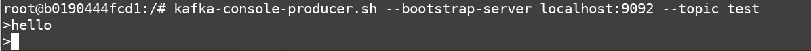
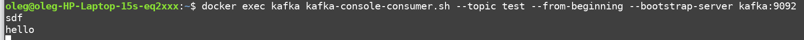

### 1. создание топика `test`

```shell
docker exec kafka kafka-topics.sh --create --topic test --partitions 1 --replication-factor 1 --bootstrap-server kafka:9092
``` 

### 2. убеждаемся что он создан

```shell
docker exec kafka kafka-topics.sh --describe --bootstrap-server kafka:9092
```


### 3. Отправка сообщения в топик
```shell
docker exec -it kafka bin/bash
kafka-console-producer.sh --bootstrap-server localhost:9092 --topic test
```


### 4. Чтение сообщений из топика

```shell
docker exec kafka kafka-console-consumer.sh --topic test --from-beginning --bootstrap-server kafka:9092
```


